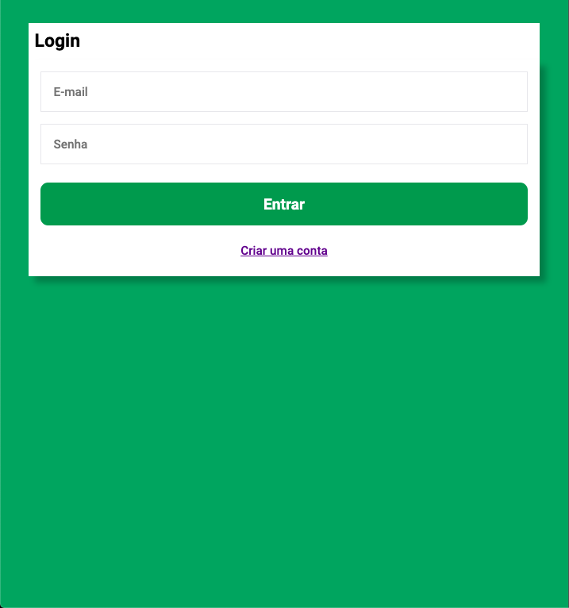
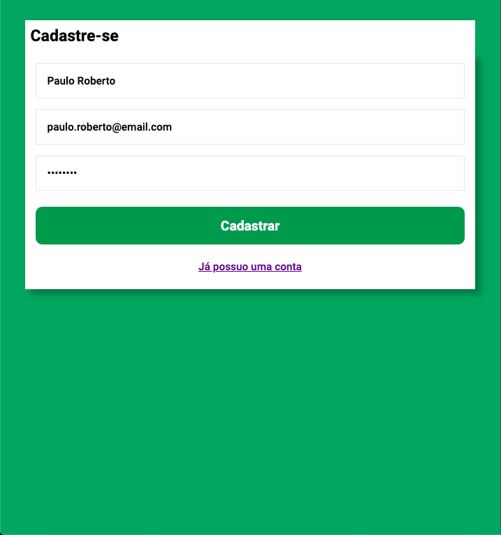
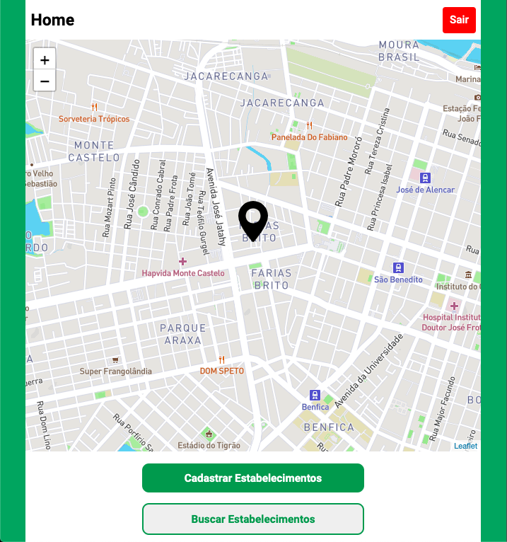
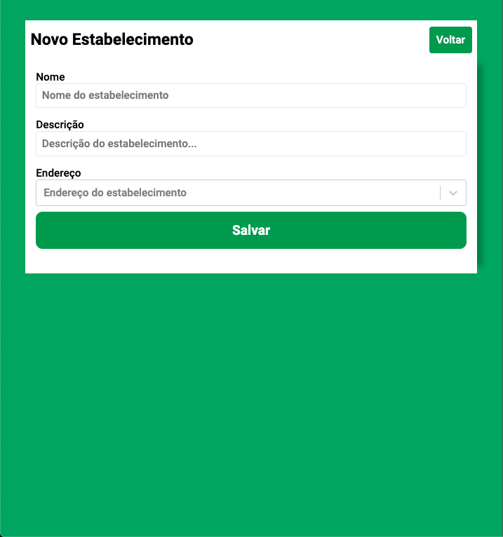
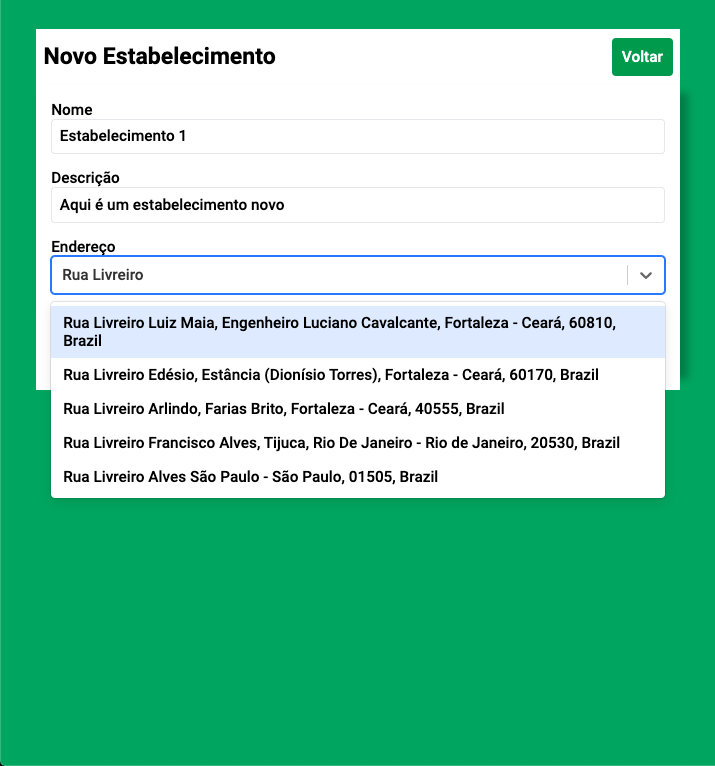
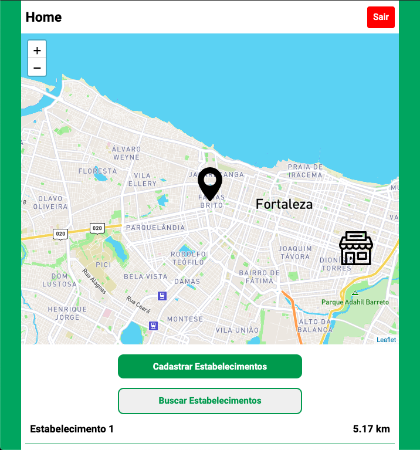

# Gerenciador de estabelecimentos - Backend

- [Especificações](#Especificações)
- [Descrição](#descri%c3%a7%c3%a3o)
- [Executando o projeto (desenvolvimento)](#rodando-o-projeto-desenvolvimento)

## Descrição

Api de um projeto de gerenciamento de estabelecimentos desenvolvido utilizando a tecnologia ReactJS. O projeto faz uso de de uma api que encontra-se no repositório abaixo, assim para o funcionamento da aplicação, faz-se necessário rodar o projeto da API (atualmente rodando na porta 3333):
[Projeto da API](https://github.com/felipeosilva/gerenciador-estabelecimento-backend)

## Imagens
# Imagens








## Especificações

Especificações do projeto

- React >= 17
- yarn >= 1.22

## Rodando o projeto (desenvolvimento)

### Instalação na maquina local

```bash
# Clonar repositório
$ git clone https://github.com/felipeosilva/gerenciador-estabelecimento-web.git

# Pasta do clone
$ cd gerenciador-estabelecimento-web

# Cria arquivo .env com base no modelo .env.example, lembrando que é necessário possuir o token do MapBox.
$ cp .env.example .env

# Instalar todas as dependências
$ yarn install

# Comando para executar a aplicação, projeto rodando em localhost:3333
$ yarn start
```